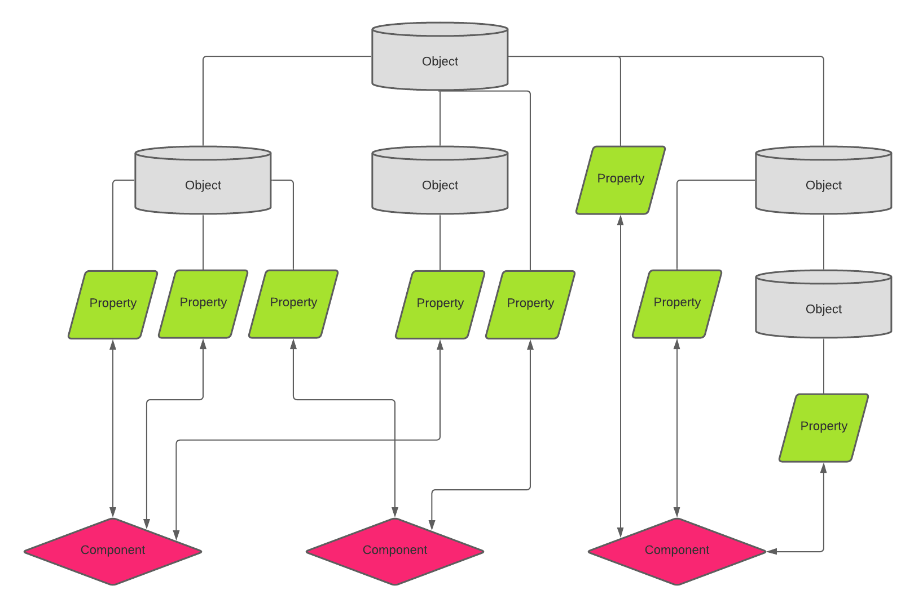

## 🙌 use-change

[](https://badge.fury.io/js/use-change) [](http://www.typescriptlang.org/) [](https://github.com/finom/use-change/actions)

> The one React hook for application state

The idea of this library is that you define a skeleton of your data store as a flat or a nested object, and with the help of [Object.defineProperty](https://developer.mozilla.org/en-US/docs/Web/JavaScript/Reference/Global_Objects/Object/defineProperty) listen to changes at properties of the object. No reducers, actions, observers, middlewares, exported constants. Just one hook and some secondary API you may not even need.

Components that include `useChange` listen to only those properties that they actually need but never updates if something else is changed.

## 📋 Table of Contents


<!--ts-->

- [🙌 use-change](#-use-change)
- [📋 Table of Contents](#-table-of-contents)
- [☕ Quick start](#-quick-start)
- [💡 Quick start using Provider](#-quick-start-using-provider)
- [👷 Designing the store](#-designing-the-store)
- [✔️ Summary](#️-summary)
- [🚀 API](#-api)
  - [`useChange`](#usechange)
- [🤖 Secondary API](#-secondary-api)
  - [`useValue`](#usevalue)
  - [`useSet`](#useset)
  - [`useSilent`](#usesilent)
  - [`listenChange`](#listenchange)
  - [`unlistenChange`](#unlistenchange)
  - [`Context`](#context)
  - [`Provider`](#provider)
- [🏔️ Persistent store](#️-persistent-store)
- [🐞 Known TypeScript issues](#-known-typescript-issues)
  - [Issue 1](#issue-1)
  - [Issue 2](#issue-2)
- [Credits](#credits)

<!-- Added by: finom, at: Wed Mar 24 14:20:20 EET 2021 -->

<!--te-->



## ☕ Quick start

1. Install by `npm i use-change` or `yarn add use-change`.
2. Define an object of any shape. It's going to be your store.
3. Add `useChange` to your component.

```js
import React, { ReactElement } from 'react'
import useChange from 'use-change';

const store = { count: 0 };

const MyComponent = (): ReactElement => {
  const [count, setCount] = useChange(store, 'count');
  
  return (
    <>
      <p>{count}</p>
      <button onClick={() => setCount(count + 1)}>Increment</button>
    </>
  )
}

export default MyComponent;
```

`store.count` is updated using `setCount` function from the touple returned by `useChange` (just like using `React.useState`). It can also be updated just by direct modification of `count` property:

```js
// ...
// you can do it from anywhere
store.count = 69; // nice
```

The example shows how you can use the hook as a local data store for a component but `store` object can be exported and used by other components. This may be an anti-DRY pattern, that's why it's recommended to use `Provider` exported from `use-change`.

## 💡 Quick start using Provider

1. Install by `npm i use-change` or `yarn add use-change`.
2. Define an object of any shape. This is going to be your store.
3. Wrap your components by `Provider` exported by `use-change`.
4. Add `useChange` to your components.

```js
import React, { ReactElement } from 'react';
import useChange, { Provider as UseChangeProvider } from 'use-change';
import MyComponent from './MyComponent';

const store = { count: 0 };

const App = (): ReactElement => (
  <UseChangeProvider value={store}>
    <MyComponent />
  </UseChangeProvider>
)

export default App;
```

```js
// ./MyComponent.tsx
import React, { ReactElement } from 'react'
import useChange from 'use-change';

const MyComponent = (): ReactElement => {
  const [count, setCount] = useChange('count');
  
  return (
    <>
      <p>{count}</p>
      <button onClick={() => setCount(count + 1)}>Increment</button>
    </>
  )
}

export default MyComponent;
```

## 👷 Designing the store

You can use an object literal to define store for simple use, but real world data usually consists more than just a `count`. It's recommended to build your store as a class instance. Shape of the class is 100% custom and it doesn't require to use decorators or wrappers.

```js
// ./store.ts
export class RootStore {
  public count = 0;
  // ...
}

export default new RootStore();
```

Then import the store and use it as `Provider` value.

```js
import React, { ReactElement } from 'react';
import useChange, { Provider as UseChangeProvider } from 'use-change';
import MyComponent from './MyComponent'; // ./MyComponent.tsx remains the same
import store from './store';

const App = (): ReactElement => (
  <UseChangeProvider value={store}>
    <MyComponent />
  </UseChangeProvider>
)

export default App;
```

Let's make it more complex and add a few classess that may be responsible for different aspects of data. Those classes may consist user info, fetched data, persistent data or anything else that you want to keep at its own place. But for siplicity let's add a few classess that also consist just counts.

```js
// ./store.ts
class StoreBranchA {
  public aCount = 0;
}

class StoreBranchB {
  public bCount = 0;
}

export class RootStore {
  public readonly storeBranchA = new StoreBranchA();
  public readonly storeBranchB = new StoreBranchB();
}

export default new RootStore();
```

Meet the third and the last overload of `useChange` hook, where the first argument of the function is **store selector** and the second, as usually, a property name.

```js
// ./MyComponent.tsx
import React, { ReactElement } from 'react'
import useChange from 'use-change';
import { RootStore } from './store';

const MyComponent = (): ReactElement => {
  const [countA, setCountA] = useChange(({ storeBranchA }: RootStore) => storeBranchA, 'countA');
  const [countB, setCountB] = useChange(({ storeBranchB }: RootStore) => storeBranchB, 'countB');
  
  return (
    <>
      <p>{countA}</p>
      <button onClick={() => setCountA(countA + 1)}>Increment count A</button>
      <p>{countB}</p>
      <button onClick={() => setCountB(countB + 1)}>Increment count B</button>
    </>
  )
}
```

As you can see we've passed `({ storeBranchA }: RootStore) => storeBranchA` as a first argument selecting that piece of store that consists the sought property. There is also a small noteworthy detail. We import `RootStore` class to be used just as a type, but we don't import store itself there thanks to `Provider`. You can import it though just to check how cool the hook is!

```js
// ...
import store, { RootStore } from './store';

setInterval(() => {
  store.storeBranchA.countA++;
}, 1000);

const MyComponent = (): ReactElement => {
// ...
```


The component is going to be updated every second since it listens to the `store.storeBranchA.countA` property changes.

## ✔️ Summary

Congrats! You basically passed the tutorial of how to use `use-change` hook! Let's just mention a few last notes:

**The hook supports 3 overloads**
1. Explicit store use. At this case you pass the store object to `useChange` hook: `useChange<T>(object: T, key: string)`
2. Implicit store use where the store object is passed as `Provider` value and the listenable property is located in the root of store `useChange<T>(key: string)` 
3. Implicit store use where the store object is passed as `Provider` value and the listenable property is located in a nested object from the store `useChange<T>(storeSelector: (store: T) => object, key: string)` 

**Store is mutable, state is immutable.** Think of store as of tree with trunk and branches that never change and on the branches there are leaves that can fall and grow infinite number of times. 


As another example let's take a look at a custom store interface.

```js
interface RootStore {
  readonly me: {
    isAuthenticated: boolean; 
    name: string;
  }
  
  readonly shop: {
    readonly cart: {
      items: ShoppingCartItem[];
    }
    
    deliveryAddress: string;
  }
}
```

If store is implemented by the interface, then:

- `RootStore['me']`, `RootStore['shop']`, `RootStore['shop']['cart']` should not be changed since they're "tree branches". These properties are the **store** that can be returned by store selectors.
- But `RootStore['me']['isAuthenticated']`, `RootStore['me']['name']`, `RootStore['shop']['cart']['items']`, `RootStore['shop']['deliveryAddress']`  can, since they're "tree leaves" that can be listened by components. These properties are the **state**.

This means that any listenable property need to be overriden by a new value, but never mutated.

```js
const [cartItems, setCartItems] = useChange(
  ({ shop }: RootStore) => shop.cart, // select the "tree branch"
  'items', // use shop.cart.items property
);

// ...

// create a new array to be used as shop.cart.items value
setCartItems([
  ...cartItems,
  newItem,
]);

// or
store.shop.cart.items = [
  ...cartItems,
  newItem,
];

// but never mutate the array
// cartItems.push(newItem); // wrong
// store.shop.cart.items.push(newItem); // also wrong
```


## 🚀 API

### `useChange`

**Explicit store overload.** At this case you provide store object directly. Use cases: 

1. You don't want to use `Provider`.
2. You have existing application and you want to add some extra logic without affecting entire application.

In other cases it's recommended to use overload with store selector.

`useChange<T, K>(object: T, key: K & keyof T & string) => [value: inferred, setter: (value: inferred) => inferred]`

```js
interface RootStore {
  foo: { 
    bar: { 
      key: string;
    } 
  }
}

const store: RootStore = { foo: { bar: { key: 'value' } } };
// ...
const [value, setValue] = useChange(store.foo.bar, 'key'); // value is inferred as string
```


**Implicit root store overload.** This overload doesn't require to provide neither store object nor store selector. Key provided as the only argument.

`useChange<T, K>(key: K & keyof T & string): [value: inferred, setter: (value: inferred) => inferred]`

```js
const store = { key: 'value' };
// ...
const [value, setValue] = useChange<RootStore>('key')
```

There are noteworthy restrictions of this overload described at [Known TypeScript issues](#known-typescript-issues).

**Implicit store overload with store selector.** The recommended way to use `useChange` if it's used as a core data store library of your app.

`useChange<T, K, S>(getStore: (store: T) => S, key: K & keyof S & string): [value: inferred, setter: (value: inferred) => inferred]`

```js
interface RootStore {
  foo: { 
    bar: { 
      key: string;
    } 
  }
}
const store: RootStore = { foo: { bar: { key: 'value' } } };
// ...
const [value, setValue] = useChange((store: RootStore) => store.foo.bar, 'key'); // value is inferred as string
```

## 🤖 Secondary API

The library also provides a few helpful hooks and functions that cover additional needs while using `useChange`.


### `useValue`

Supports 100% the same overload as `useChange` does and works the same but instead of a `[value, setter]` touple it returns just a `value` (zero-indexed element of the touple). 

```ts
const value = useValue((store: RootStore) => store.foo.bar, 'key');

// 100% equivalent of 
const [value] = useChange((store: RootStore) => store.foo.bar, 'key');

// or 
const value = useChange((store: RootStore) => store.foo.bar, 'key')[0];
```

### `useSet`

Supports 100% the same overload as `useChange` does but instead of a `[value, setter]` touple it returns just a `setter` (element of index 1 of the touple). The hook **doesn't trigger component re-render** when property value is changed.

```ts
const setBarKey = useSet((store: RootStore) => store.foo.bar, 'key');

// almost the same as the following, but doesn't trigger component re-render
const setBarKey = useChange((store: RootStore) => store.foo.bar, 'key')[1];
```


### `useSilent`

Supports 100% the same overload as `useChange` does but returns `value` and **doesn't trigger component re-render** when property value is changed. This is the "silent twin" of `useValue`.

```ts
const value = useSilent((store: RootStore) => store.foo.bar, 'key');
```

It's used for cases if you want to get something unchengeable. A good example is store methods: they don't need to get their property descriptor to be modified.

```js
// ./store.ts
class StoreBranch {
  public count = 0;
  
  public readonly incrementCount = () => {
    this.count++;
  }
}

export class RootStore {
  public readonly storeBranch = new StoreBranch();
}

export default new RootStore();
```

```ts
const incrementCount = useSilent((store: RootStore) => store.storeBranch, 'incrementCount');
// ...
incrementCount();
```

### `listenChange`

Allows to listen to object property changes outside of components. The store object argument should be given explicidly since `Provider` doesn't work here anymore. The method returns a funciton that unsubscribes from a given event.

`listenChange<T, K>(store: T, key: K & keyof T & string, listener: (value: inferred) => void): () => void`

```ts
const store = { count: 0; };

const unlisten = listenChange(store, 'count', (count) => console.log('the count is: ', count));

setTinterval(() => {
  store.count++;
}, 1000);
```


### `unlistenChange`

Allows to remove of previously attatched listener.

`unlistenChange<T, K>(store: T, key: K & keyof T & string, listener: (value: inferred) => void): void`

```ts
const store = { count: 0; };

const handler = (count) => console.log('the count is: ', count);

listenChange(store, 'count', handler);

// ... 

unlistenChange(store, 'count', handler);
```


### `Context`

React context used for the store provider. You can use `Context` with `React.useContext` to receive store object without importing it.

```ts
import React, { useContext } from 'react';
import { Context as UseChangeContext } from 'use-change';
import { RootStore } from './store';

const MyComponent = () => {
  const store = useContext<RootStore>(UseChangeContext);
  // ...
}
```

### `Provider`

The context provider. It equals to `Context.Provider`.

```js
import React, { ReactElement } from 'react';
import { Provider as UseChangeProvider } from 'use-change';
import MyComponent from './MyComponent';

const store = { count: 0 };

const App = (): ReactElement => (
  <UseChangeProvider value={store}>
    <MyComponent />
  </UseChangeProvider>
)

export default App;
```

## 🏔️ Persistent store

There is no built-in feature to store data persistently but the elegancy of use-change design makes possible to create such thing easily.

```js
// ./PersistentStore.ts
import { listenChange } from 'use-change';

// the function returns localStorage value or default value if localStorage value doesn't exist
function persistentValue<T>(key: keyof PersistentStore, defaultValue: T) {
  const storageValue = localStorage.getItem(key);
  return storageValue ? JSON.parse(storageValue) as T : defaultValue;
}

// define the part of root store that responsible for persistent store
export class PersistentStore {
  public age = persistentValue<number>('age', 18);

  public firstName = persistentValue<string>('firstName', 'John');

  public lastName = persistentValue<string>('lastName', 'Doe');

  constructor() {
    // enumerate over own property names (age, firstName, lastName)
    // and define property change listener to update localStorage
    Object.getOwnPropertyNames(this).forEach((key) => {
      listenChange(this, key, (value) => {
        localStorage.setItem(key, JSON.stringify(value));
      });
    });
  }
}

export default new PersistentStore();

```

Use the class instance as part of your root store.

```js
// ./store.ts
import { PersistentStore } from './PersistentStore';

export class RootStore {
  public readonly persistent = new PersistentStore();
}

export default new RootStore();
```

Then use it as any other custom object.

```js
// the value will be written into localStorage
store.persistent.age = 20;
```

```js
// or with a use-change hook
import useChange from 'use-change';

// ...
const [age, setAge] = useChange(({ persistent }: RootStore) => persistent, 'age');
// ...
// the value will be written into localStorage
setAge(20);
```

## 🐞 Known TypeScript issues

If you know how to fix one of the following TypeScript problems, please make a PR or create an issue with your idea of how it could be fixed.

### Issue 1

Implicit root store overload makes TypeScript unable to detect exact type of a property if 2nd generic parameter isn't given.

```ts
interface RootStore {
  isSomething: boolean;
  count: number;
}

// ... 

// value type is inferred as "boolean | number" instead of "boolean"
const [value] = useChange<RootStore>('isSomething');
```


There are two workarounds to fix it. The first is to provide key literal as the second generic parameter:

```ts
const [value] = useChange<RootStore, 'isSomething'>('isSomething');
```


If it looks weird to you there is 2nd workaround using implicit store overload with store selector: 

```ts
const [value] = useChange((store: RootStore) => store, 'isSomething');
```

That's why this is the most recommended way of `useChange` use.


### Issue 2

Typescript error is not informative if a provided key is not a key of store slice.


But if a correct key is provided, the error will disappear. 


## Credits

Seasons Tree Image - <a href="https://www.vecteezy.com/free-vector/nature" target="_blank">Nature Vectors by Vecteezy</a>
